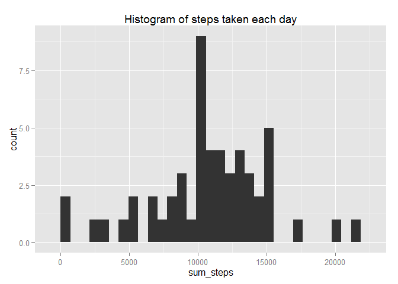
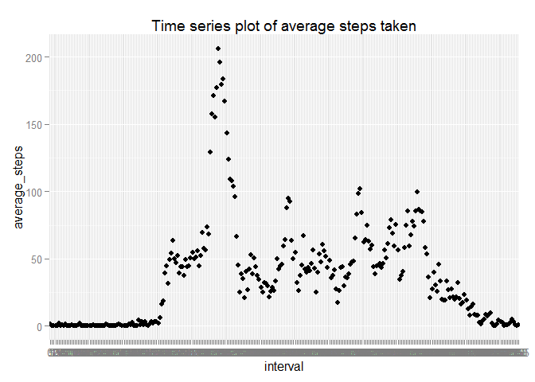
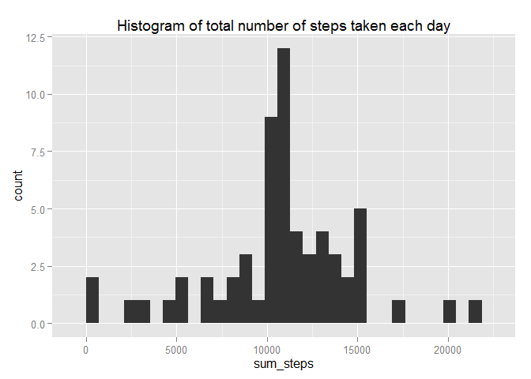
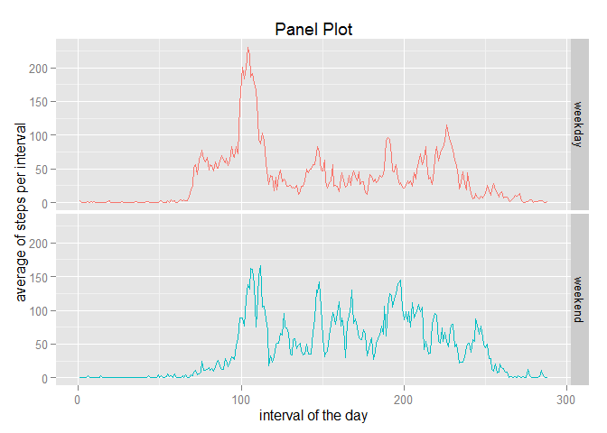

My Assignement 1 for "Reproducible Research"
============================================

Part 1: What is mean total number of steps taken per day? (Without NA)
======================================================================

1.Step: Reading the data
------------------------

Set the working directory which is on the Desktop and load the raw data

    setwd("C:/Users/Harry/Desktop/5- Reproducability Research/Assignment 1")
    rawdata <- read.csv("activity.csv")
    class_steps <- class(rawdata$steps)
    class_date <- class(rawdata$date)
    class_interval <-class(rawdata$interval)
    numberrows <- nrow(rawdata)

The data has three columns and the following data types:  
steps: integer  
date: factor  
interval: integer  
and 17568 measurements

2. Step: Tidy the data up
-------------------------

We build now our tidy data set: - date is transformed into a date format
- interval into a factor - all steps with NA value are removed

    tidydata <- rawdata
    tidydata$date <- as.Date(as.character(tidydata$date))
    tidydata$interval<-as.factor(tidydata$interval)
    tidydata <- tidydata[complete.cases(tidydata),]
    nowrows <- nrow(tidydata)

Now our data is tidy and has 15264 of measurements.

3. Step: What is the average daily activity pattern?
----------------------------------------------------

### Analyse the data

We will use the dplyr-package for analysis and ggplot for graphics

### 3.1. Calculate the number of steps for each day

    library(dplyr)

    ## 
    ## Attaching package: 'dplyr'
    ## 
    ## The following object is masked from 'package:stats':
    ## 
    ##     filter
    ## 
    ## The following objects are masked from 'package:base':
    ## 
    ##     intersect, setdiff, setequal, union

    library(ggplot2)

    result <- summarise(group_by(tidydata,date),sum(steps))
    colnames(result) <- c("date","sum_steps")

Lets explore the result:

    library(ggplot2)
    qplot(data= result, date, sum_steps, main="Number of steps taken each day")

### 3.2. Lets have a look at the result with a histogram

The historgram shows the distribution:

    qplot(data=result, sum_steps, main="Histogram of steps taken each day")

    ## stat_bin: binwidth defaulted to range/30. Use 'binwidth = x' to adjust this.

### 3.3. Lets have a lock at the mean of steps and median of steps for each day

    result2 <- summarise(result,mean(sum_steps))
    result3 <- summarise(result,median(sum_steps))
    Meansteps <- as.character(result2)
    Mediansteps <- as.character(result3)

This is the **mean** of steps for each day: **10766.1886792453
steps**.  
This is the **median** of steps for each day: **10765 steps**.

4. What is the average daily activity pattern?
----------------------------------------------

### 4.1. Eplore the activity

On the x-axis: intervals of a day  
On the y-axis: mean of interval across all days

    result4 <- summarise(group_by(tidydata,interval),mean(steps))
    colnames(result4) <- c("interval","average_steps")
    qplot(data=result4,interval,average_steps, main="Time series plot of average steps taken")

    Max_average <- max(result4$average_steps)
    Max_interval <- subset(result4, Max_average==average_steps)

The maximum average number of steps is 206.1698113  
at **interval 835**.

Part 2: Imputing missing values
===============================

We start with the raw data again and make them clean.  
\#\# 1.Step: Cleaning and counting NA rows

    tidydata2 <- rawdata
    tidydata2$date <- as.Date(as.character(tidydata2$date))
    tidydata2$interval<-as.factor(tidydata2$interval)
    nowrows2 <- nrow(tidydata2)
    NAinData <- nowrows2 - nowrows
    inpercent <- round(NAinData/nowrows2*100,0)

The data set has 2304 rows with NA data: this is 13% of all rows.

2. Step: Replace strategy
-------------------------

Let us use a **strategy to replace the NA values** with the **mean
value** for the interval across all days.

    result5 <- summarise(group_by(tidydata2,interval),mean(steps, na.rm=TRUE))
    colnames(result5) <- c("interval","average_steps")
    #select the NA data
    bad<- is.na(tidydata2$steps)
    allNA<-subset(tidydata2, bad)
    #replace the NA with the mean for this interval
    for (i in 1:nrow(allNA)){
        b <- allNA[i,3]
        a <- subset(result5,b==result5$interval)
        newsteps <-round(a$average_steps,0)
        allNA[i,1] <- newsteps
    }
    #new data with NA relaced by mean: take the tidydata with NA and add our allNA with the means
    tidydata3 <- rbind(tidydata,allNA)

3. Analyse the data with replaced NA by mean of interval
--------------------------------------------------------

### 3.1. Histrogram

The historgram shows the distribution; number of steps by day

    result6 <- summarise(group_by(tidydata3,date),sum(steps))
    colnames(result6) <- c("date","sum_steps")
    qplot(data=result6, sum_steps, main="Histogram of total number of steps taken each day")

    ## stat_bin: binwidth defaulted to range/30. Use 'binwidth = x' to adjust this.

### 3.2. Lets have a lock at the mean of steps and median of steps for each day

    result21 <- summarise(result6,mean(sum_steps))
    result31 <- summarise(result6,median(sum_steps))
    Meansteps1 <- as.character(result21)
    Mediansteps1 <- as.character(result31)

This is the mean of steps for each day: 10765.6393442623 steps.  
This is the median of steps for each day: 10762 steps.

Compare result with "NA removed"" and with "NA replaced by mean of interval"
============================================================================

4.1 Mean-Median per day
-----------------------

Let's build a table for comparision for mean and median:

    data.frame(Cases=c("NA removed", "NA replaced by mean"), Number_of_cases= c(nowrows,nowrows2), Mean_value= c(Meansteps,Meansteps1), Median_value= c(Mediansteps, Mediansteps1))

    ##                 Cases Number_of_cases       Mean_value Median_value
    ## 1          NA removed           15264 10766.1886792453        10765
    ## 2 NA replaced by mean           17568 10765.6393442623        10762

Conclusion: there is only a slight effect on relpacing NA values with
the mean of the interval.

4.2. Total number of steps per day
==================================

We take the data set without NA and calculate the total number of steps
per day. We then take the data set with replaced NA by mean and
calculate the total number of steps per day.

    stepsNAremoved <- summarise(group_by(tidydata,date),sum(steps))
    colnames(stepsNAremoved)<-c("dates","steps")
    stepsNAreplaced <- summarise(group_by(tidydata3,date), sum(steps))
    colnames(stepsNAreplaced)<-c("dates","steps_NA_corrected")
    result7<- merge(stepsNAremoved, stepsNAreplaced, by="dates",all=TRUE)
    result7$impact <- result7$steps_NA_corrected-result7$steps

The replacement of missing values (NA) by a mean values has given days
without measurement now a value.

    result7

    ##         dates steps steps_NA_corrected impact
    ## 1  2012-10-01    NA              10762     NA
    ## 2  2012-10-02   126                126      0
    ## 3  2012-10-03 11352              11352      0
    ## 4  2012-10-04 12116              12116      0
    ## 5  2012-10-05 13294              13294      0
    ## 6  2012-10-06 15420              15420      0
    ## 7  2012-10-07 11015              11015      0
    ## 8  2012-10-08    NA              10762     NA
    ## 9  2012-10-09 12811              12811      0
    ## 10 2012-10-10  9900               9900      0
    ## 11 2012-10-11 10304              10304      0
    ## 12 2012-10-12 17382              17382      0
    ## 13 2012-10-13 12426              12426      0
    ## 14 2012-10-14 15098              15098      0
    ## 15 2012-10-15 10139              10139      0
    ## 16 2012-10-16 15084              15084      0
    ## 17 2012-10-17 13452              13452      0
    ## 18 2012-10-18 10056              10056      0
    ## 19 2012-10-19 11829              11829      0
    ## 20 2012-10-20 10395              10395      0
    ## 21 2012-10-21  8821               8821      0
    ## 22 2012-10-22 13460              13460      0
    ## 23 2012-10-23  8918               8918      0
    ## 24 2012-10-24  8355               8355      0
    ## 25 2012-10-25  2492               2492      0
    ## 26 2012-10-26  6778               6778      0
    ## 27 2012-10-27 10119              10119      0
    ## 28 2012-10-28 11458              11458      0
    ## 29 2012-10-29  5018               5018      0
    ## 30 2012-10-30  9819               9819      0
    ## 31 2012-10-31 15414              15414      0
    ## 32 2012-11-01    NA              10762     NA
    ## 33 2012-11-02 10600              10600      0
    ## 34 2012-11-03 10571              10571      0
    ## 35 2012-11-04    NA              10762     NA
    ## 36 2012-11-05 10439              10439      0
    ## 37 2012-11-06  8334               8334      0
    ## 38 2012-11-07 12883              12883      0
    ## 39 2012-11-08  3219               3219      0
    ## 40 2012-11-09    NA              10762     NA
    ## 41 2012-11-10    NA              10762     NA
    ## 42 2012-11-11 12608              12608      0
    ## 43 2012-11-12 10765              10765      0
    ## 44 2012-11-13  7336               7336      0
    ## 45 2012-11-14    NA              10762     NA
    ## 46 2012-11-15    41                 41      0
    ## 47 2012-11-16  5441               5441      0
    ## 48 2012-11-17 14339              14339      0
    ## 49 2012-11-18 15110              15110      0
    ## 50 2012-11-19  8841               8841      0
    ## 51 2012-11-20  4472               4472      0
    ## 52 2012-11-21 12787              12787      0
    ## 53 2012-11-22 20427              20427      0
    ## 54 2012-11-23 21194              21194      0
    ## 55 2012-11-24 14478              14478      0
    ## 56 2012-11-25 11834              11834      0
    ## 57 2012-11-26 11162              11162      0
    ## 58 2012-11-27 13646              13646      0
    ## 59 2012-11-28 10183              10183      0
    ## 60 2012-11-29  7047               7047      0
    ## 61 2012-11-30    NA              10762     NA

Part 3: Are there differences in activity patterns between weekdays and weekends?
=================================================================================

We use for this analysis the data set with the replaced NA by the mean
of the interval (of all days).

My Question: is there a difference in weedays (Mo-Fr) to weekend
(Saturday & Sunday)?

    tidydata3$day <- weekdays(tidydata3$date,abbreviate = FALSE)
    # decide if weekday or weekend
    tidydata3$day["Samstag"==tidydata3$day]<-"weekend"
    tidydata3$day["Sonntag"==tidydata3$day]<-"weekend"
    tidydata3$day["weekend"!=tidydata3$day]<-"weekday"
    tidydata3$day <- as.factor(tidydata3$day)
    # create the summary for the plot
    result8<-summarise(group_by(tidydata3,day,interval),mean(steps))
    colnames(result8) <- c("day","interval","sum_steps")  #adjust the names of columns

    qplot(data=result8,as.numeric(interval),sum_steps, col=day, geom="line", main= "Panel Plot")+facet_grid(day~.)+xlab("interval of the day")+ylab("average of steps per interval")+guides(col=FALSE)

